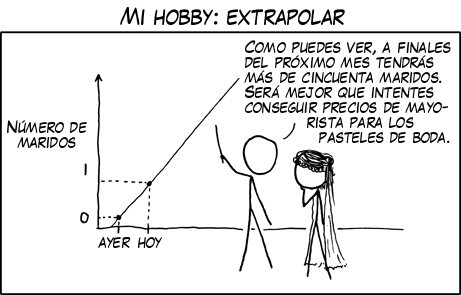
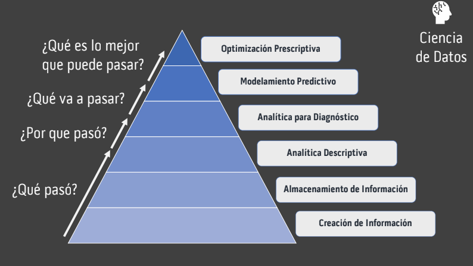
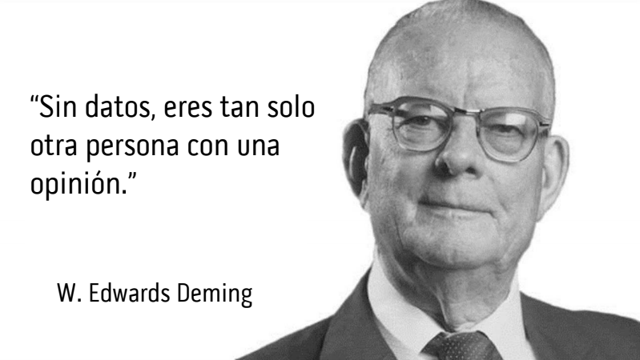

_Más sabe el diablo por viejo que por diablo._

# **Inteligencia de Datos**
---

Un _dato_ es un hecho medible y comunicable: una hora, lugar, nombre, número. Un dato es un "pedazo" o unidad de información. El hecho que mi esposa haya llegado hoy a la casa a las 5:54PM es un _dato_. Cuando hablamos de _información_, estamos hablando en realidad del plural o un conjunto de datos.

Un _insight_ (pronunciado _insaigt_, del inglés) es un aprendizaje obtenido de la unión de varios, idealmente muchos datos. Estos pueden ser agregados de manera simple o transformados con cualquier variedad de técnicas para llegar al _insight_. Utilizo la palabra insight por que no tiene una traducción exacta al español del inglés, pero es un concepto tan poderoso que no puede ser reemplazado por una traducción inexacta. Su definición exacta según el diccionario Oxford es "un entendimiento profundo y exacto", haciendo énfasis en que el insight es el entendimiento en sí como sustantivo. Por ejemplo, si se que mi esposa llega todos los días a la casa alrededor de las 6PM, eso es un *entendimiento* profundo acerca de mi esposa, o un _insight_.

No todos los insights son igual de valiosos. Si los datos de los que se compone son erróneos por algún motivo, el insight será erróneo también. También suelen tener fecha de caducidad: puede que lo que aprendí hace 20 años hoy no sea vigente. Y la cantidad de datos es también relevante: un insights construido con dos datos no es tan robusto como uno que se componga de una serie de cientos, miles o millones.

 _Fuente: XKCD_

Hay insights que son muy resistentes al tiempo y mantienen su calidad. Los refranes, por ejemplo, son insights creados a partir de datos recogidos en la experiencia de la vida diaria de toda una cultura durante generaciones y convertidos en una enseñanza fácil de entender y aprender: "camarón que se duerme se lo lleva la corriente", "más sabe el diablo por viejo que por diablo".  Estos refranes alimentan el conocimiento de dominio de la vida diaria para toda una cultura.

Otros, cómo la serie de desayunos que he tenido en el último mes, son más etéreos. Hoy no recuerdo ya que desayuné antier, y no es poco común que olvide que he desayunado cuando llega la noche. El insight de la cantidad de calorías promedio ingeridas en un desayuno por mi en comparación a mi esposa sería divertido de conocer, pero olvidado con celeridad como un dato curioso dado que ni soy dado a contar calorías, ni mi esposa a hacer comparaciones de ese tipo.

En general se sigue un proceso sencillo para crear los insights: En primer lugar debemos hacer una _pregunta_.  Luego, entendemos la calidad de los datos mismos y corregimos sus deficiencias. Por último, se busca crear insights que nos ayuden a responder nuestra pregunta por medio de modelos simples o sofisticados. Algunos modelos simples son las líneas de tiempo o las regresiones, algunos de los sofisticados son los Arboles de Decisión o las famosas Redes Neuronales. Nuestra pregunta va a determinar la complejidad de nuestros modelos:

¿Qué pasó? Simple.
¿Por qué pasó? No tan fácil. 
¿Qué va a pasar? Difícil.
¿Qué es lo mejor que puede pasar? Más Complejo.

 _Fuente: Dylan Gregersen_

Un grupo de insights relacionados nos da conocimiento de dominio. Acá, "dominio" es sinónimo de "campo" o "tema". El conocimiento de dominio es la suma del conocimiento en general que una *persona* tiene respecto a un dominio en particular.

Cada persona tiene un conocimiento de dominio diferente dependiendo del ámbito: puede que mi abogado sea un experto en ley comercial colombiana, pero tiene un conocimiento de dominio medio en ajedrez, y uno muy pobre en tejer crochet.

A mayor conocimiento de dominio, se toman decisiones más inteligentes, entiéndase, decisiones con mayor probabilidad de ser acertadas o correctas. Dado que tengo conocimiento de dominio sobre mi esposa, tengo el insight que mi esposa llega a casa a las 6PM, y también sé que le gusta que la espere cerca a su parada de bus para caminar con ella a la casa, entonces puedo tomar la decisión de parar mis actividades a las 5:45PM para ir a recogerla. Antes de tener este conocimiento de dominio tan completo, solía llegar tarde a recogerla, lo cual definitivamente no era acertado, cómo bien me lo hizo saber.

Ese conocimiento de dominio tiene un factor de magnitud y calidad. Un ejecutivo con 30 años de experiencia en un campo de rápida innovación, pero que sigue tomando decisiones con insights de hace 10 años, probablemente tiene un amplio conocimiento de dominio, pero de baja calidad. Un joven emprendedor de 30 años que va a lanzar su primera empresa con conocimiento fresco puede que tenga un conocimiento de dominio más reducido en magnitud, pero de mayor calidad.

Pero este salto de insight a conocimiento no pasa por arte de magia: Los hallazgos de ese proceso deben explicarse de tal manera que sean entendidos fácilmente. Un insight **tiene que** comunicarse de la manera más entendible posible. La habilidad más valiosa de la persona o equipo encargada de medir, guardar, transformar y comunicar los datos no es la manipulación de la data para crear insights, sino la explicación del insight para crear conocimiento de dominio.

Ese conocimiento de dominio, una vez ha sido cultivado con cariño y datos, permite alimentar y mejorar las demás fases del proceso. La experiencia es la mejor consejera a la hora de entender que datos buscar, como cocinarlos de la manera perfecta para la industria y el problema en mano, y como servirlos y comerlos de tal manera que todas las personas de nuestra organización los digieran bien para crecer grandes, _informados_ e inteligentes. Esto es lo que va a diferenciar sus decisiones de simples opiniones.

Este proceso de medir, entender, transformar y explicar información es lo que hoy se conoce como "Ciencia de Datos". En mi opinión, la primera parte del nombre está sobredimensionada. La variedad de datos a medir es limitada solo por la creatividad. No se necesita ciencia sino conocimiento de dominio e intuición para encontrar que más podemos medir en nuestros procesos. 

En la transformación se usa una infinidad de modelos prestados de la estadística y facilitados por la computación, pero no es necesario ser matemático ni estadístico para entender sus resultados, igual que no se tiene que entender el proceso de elaboración de un pincel para saber para que sirve y entender sus efectos. Aunque vale la pena decirlo: sí es necesario, al menos hoy, saber programar para implementar aquellos modelos.  

El proceso de _explicar_, es una actividad en gran parte creativa, y lo que más se asemeja a _arte_: Las buenas visualizaciones e interfaces, que sean tanto entendibles y amigables como útiles, hacen toda la diferencia para que una montaña de datos e insights desperdiciados se convierta en un diferenciador competitivo al crear conocimiento de dominio al instante y en tiempo real para toda una organización.

Por lo tanto, el nombre "Ciencia" no es apropiado dado que esos procesos de medir, guardar, transformar y explicar datos no son gobernados por el método científico, o al menos no del todo (ni en su mayoría). Aunque recoja técnicas y habilidades de algunas ciencias como la estadística y la matemática, el proceso es mucho más flexible que estas, e involucra más intuición, suerte y creatividad. 

El fin último del proceso es llevar a la toma de decisiones inteligentes. Propongo mejor llamarlo Inteligencia de Datos o Data Intelligence, que refleja de manera mas apropiado su objetivo en vez de hacer énfasis en la metodología.

Si los insights son ignorados, la data es ignorada, y demostrablemente se tomarán peores decisiones en promedio. De igual manera, si no se miden y guardan los datos nuestros insights serán limitados o inexistentes, y la calidad de nuestras decisiones sufrirá. La calidad o inteligencia de una decisión es directamente proporcional al conocimiento de dominio de quién la toma.

Las organizaciones entonces deben ser dato-obsesivas, dato-locas, dato-maníacas, dato-fans y hasta dato-adictas para crear insights y conocimiento de dominio de calidad. Una organización solo puede tomar decisiones *competitivas* en la medida que tenga conocimiento de dominio de igual o mejor calidad que la de su competencia. 

Ser dato-obsesivas sí significa medir absolutamente todos los datos relevantes en sus procesos, guardarlos, usar la estadística, los modelos computacionales y una buena dosis de sentido común para  transformarlos, convertirlos en insights y aprender de ellos para crear conocimiento de dominio.

_Todo dato de valor debe ser medido, guardado y usado._

Ser dato-obsesivas no significa ignorar todos los principios de la estadística (grave) o del sentido común (más grave aún) para intentar encontrarle significado a esa data. Si quiero entender por qué mi perra vela la mesa con más emoción y energía en algunas ocasiones que otras, no debo empezar contando los pelos en su cabeza en cada día que vele. Probablemente tenga que ver con qué tipo de comida se cocine ese día, o que tanto ha comido en las últimos 24 horas, y deba empezar a buscar insights relacionados a esa medición más sensata.

La primera pregunta que se hará quien quisiera empezar a crear una organización data-obsesiva sería ¿por donde empiezo?. La respuesta es por sus procesos operativos: Todo proceso de una organización genera datos. En general, genera más datos que los obvios, y genera una gran cantidad de tipo de datos. Cuando me lave los dientes esta mañana, se generó el dato de la hora a la que empecé, terminé, mi velocidad y presión promedio, la calidad de mi aliento (según mi esposa=, la cantidad de bacterias exterminadas, cuántas calorías quemé en la actividad, entre muchos otros. No guardé ninguno de esos datos en mi cabeza además de la hora aproximada, pero no por eso se dejaron de generar.

Un agente en un call center también genera una gran cantidad de datos en su día laboral, solo algunos de los cuales son medidos y guardados, de los cuales aún una menor proporción son utilizados para crear insights, alimentar el conocimiento de dominio y tomar decisiones. Además de la hora, duración, grabación de audio y calificación de cada llamada, el agente también está ubicado en cierta posición de la oficina, cerca a ciertos compañeros. Tal vez cuando tiene cerca a Pedro rinde 10% menos, no por culpa de Pedro particularmente, sino por que justo este agente y Pedro tienen una amistad que los distrae y baja su productividad. También genera datos de su humor a cada hora, su estado de salud, su distancia a quien le gusta, al baño o a la máquina de café, su colonia de ese día o la cantidad de micrómetros que le crecieron las uñas ese día. Algunos de esos datos es probable que sean útiles, otros no tanto.

Las organizaciones deben de hacer un esfuerzo inmenso por identificar *datos de valor* a ser medidos dentro de sus procesos organizacionales, para que luego puedan ser guardados, transformados, agregados y utilizados. Todas las organizaciones, y en particular aquellas dónde no existiera una cultura de datos previo al conocimiento de esta metodología, deberían crear un mapa de sus procesos y los datos que estos crean. Al mapear los procesos de nuestra organización y los datos que estos generan, tendremos los insumos para entender el ciclo de vida completo de nuestra información y cuál es camino que toman esos datos al navegar en nuestra organización. 

&nbsp;
&nbsp;

##### 1. [XKCD](https://xkcd.com/) es un webcomic sobre "romance, sarcasmo, matemática y lenguaje". ¡Recomendado! Hay uno para cada situación.
##### 2. [W. Edwards Deming](https://en.wikipedia.org/wiki/W._Edwards_Deming) inventó una gran parte de los métodos de muestreo para censos modernos, entre muchas otras cosas.
##### 3. Contrario a lo que hace pensar el post, mi esposa no suele darme una calificación sobre mi aliento.
